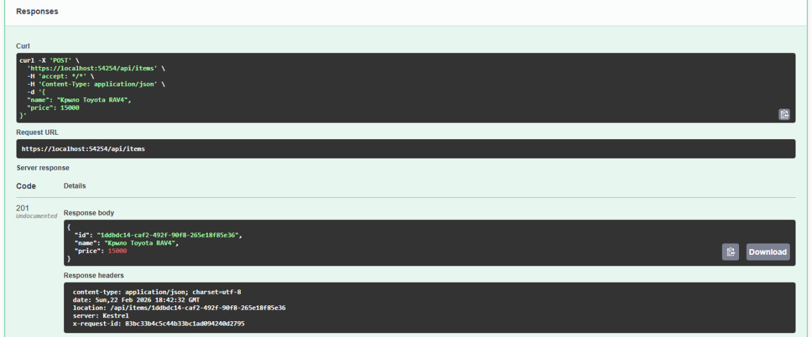
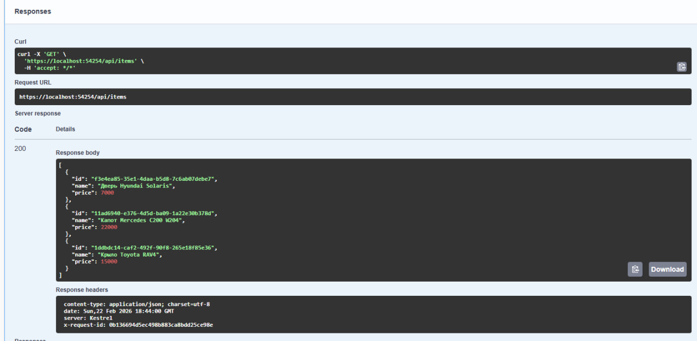
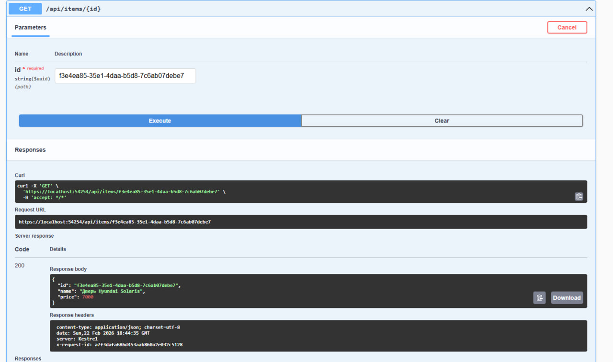
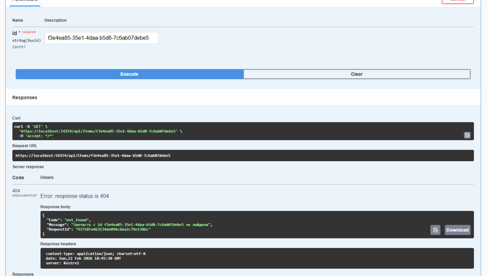
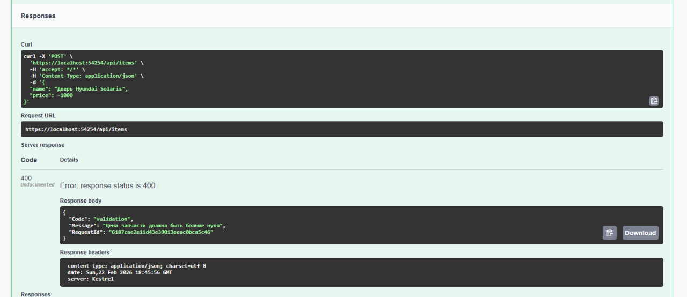
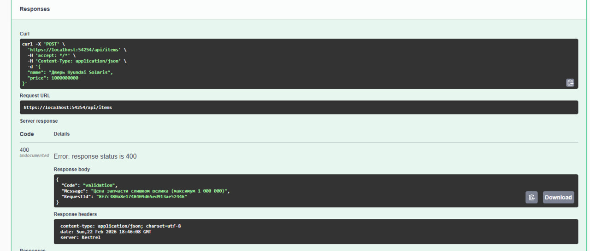

# Мини веб-служба магазина автозапчастей
Выполнена в рамках практической работы для университета

## Основные возможности
- **Swagger**: `http://localhost:5000/swagger`
- **Просмотр каталога**: `GET /api/items`
- **Поиск запчасти по ID**: `GET /api/items/{id}`
- **Добавление новой запчасти**: `POST /api/items` (с валидацией)

## Валидация данных
1. Название не должно быть пустым.
2. Название должно содержать минимум 3 и максимум 100 символов.
3. Название должно содержать хотя бы одну букву.
4. Цена должна быть строго больше нуля.
5. Цена не должна превышать 1 000 000.

## Конвейер обработки запросов
1. **RequestIdMiddleware**: Присваивает каждому запросу уникальный GUID.
2. **ErrorHandlingMiddleware**: Перехватывает исключения и возвращает их в едином формате JSON с указанием `RequestId`.
3. **TimingAndLogMiddleware**: Измеряет время выполнения и логирует детали запроса.

## Как запустить
1. На компьютере должен быть .NET 8 SDK.
2. Выполнить команду в корне проекта:
   ```bash
   dotnet run
   ```
3. Открыть Swagger UI в браузере: `http://localhost:5000/swagger`

## Результаты тестирования
### 1. Добавление новой запчасти
Успешное создание запчасти, код 201


### 2. Получение списка всех запчастей


### 3. Получение запчасти по ID
Поиск запчасти по GUID


### 4. Обработка ошибки: Запчасть не найдена
получение кода 404 при поиске запчасти с несуществующим GUID


### 5. Обработка ошибки: Некорректная цена
получение кода 400 при добавление запчасти, когда ценник ниже нуля и ценник больше 1 миллиона




## Ответы на контрольные вопросы для защиты

### 1. Что в Вашей работе выступает независимой переменной и что выступает зависимой переменной?
*   **Независимая переменная:** Это входные параметры запроса и конфигурация самого конвейера. Мы можем изменять тип запроса (валидные данные, невалидные данные, запрос несуществующего ID), набор и порядок обработчиков в Middleware, а также нагрузку (количество одновременных запросов).
*   **Зависимая переменная:** Это наблюдаемый результат работы системы, который "реагирует" на изменения: время выполнения запроса (фиксируется в `TimingAndLogMiddleware`), статус-код и формат ответа (формируется в `ErrorHandlingMiddleware`), а также наличие и корректность `RequestId` в логах и ответах.

### 2. Какие угрозы валидности у Вашего эксперимента и как Вы пытались их уменьшить?
*   **Угроза "Холодного старта" JIT-компилятора:** Первый запрос к .NET приложению всегда медленнее из-за компиляции кода. *Решение:* Использование `Stopwatch` для точных замеров и проведение "прогревочных" запросов перед фиксацией результатов.
*   **Угроза влияния инфраструктуры:** Замеры на локальной машине зависят от фоновых процессов ОС. *Решение:* Вывод времени в лог позволяет увидеть аномальные скачки и усреднить результаты для получения объективной картины.
*   **Угроза потокобезопасности:** При параллельных запросах данные в памяти могли бы повредиться. *Решение:* Использование `ConcurrentDictionary` в репозитории гарантирует целостность данных при конкурентном доступе.

### 3. Какая часть решения должна быть в ядре каркаса, а какая должна оставаться на стороне приложения?
Это разделение ответственности между инфраструктурой и бизнес-логикой:
*   **В ядре каркаса (Infrastructure):** Механизмы генерации и проброса `RequestId`, глобальный перехват исключений и приведение их к единому формату, инструменты логирования и замера производительности, а также маршрутизация и интеграция Swagger.
*   **На стороне приложения (Domain):** Конкретные правила валидации (например, ограничения на длину названия или цену), модели данных (`CarPart`) и логика хранения/выборки данных (реализация репозитория).

### 4. Какие типовые ошибки или антипаттерны Вы обнаружили в процессе реализации?
*   **Fat Controller:** Изначально вся валидация была в `Program.cs`. Это антипаттерн, так как логика проверок должна быть отделена от описания маршрутов.
*   **Magic Strings:** Использование ключей вроде `"request_id"` в разных частях кода без централизации. Исправлено выносом в константы.
*   **Некорректный порядок Middleware:** Если поставить логирование ПЕРЕД обработкой ошибок, то ошибки не будут правильно залогированы с точки зрения времени их "чистой" обработки.
*   **Отсутствие глобальной обработки исключений:** Использование `try-catch` в каждом методе вместо единого механизма в конвейере.

### 5. Как бы изменились выводы, если бы масштаб системы увеличился в десять раз?
При росте нагрузки и объема данных:
*   **Хранение:** Потребовался бы переход от локального хранения данных в кэше памяти к внешней базе данных (PostgreSQL/Redis), так как память процесса ограничена и данные теряются при перезагрузке.
*   **Логирование:** Запись в консоль стала бы узким местом. Потребовались бы асинхронные системы сбора логов.
*   **Валидация:** При увеличении количества правил потребовался бы переход к более сложным паттернам, чтобы сохранить чистоту кода.
*   **Асинхронность** При увеличении количества запросов пришлось бы приходить к асинхронности, для более быстрой их обработки.

